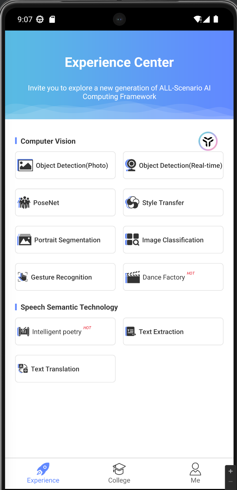

# MindSpore inhand 掌中宝
## 软件描述
软件集成了一些用mindspore训练的模型，包括图像分类、目标检测、语义分割等，用于展示mindspore的功能和性能。
## 软件功能一览

 

## 软件问题汇总
1. 问题1：软件只能在arm架构的手机上加载网络模型，在x86虚拟安卓机上无法加载。
   
2. 舞蹈梦工程无法使用，页面显示不齐全。
   
   该页面被设置为了横屏，但是页面是按竖屏设计的所以显示不全，只有半屏。更改后正常显示。
3. Quick Start内容网页都已经失效，打开后为空页面。
   

   
   

