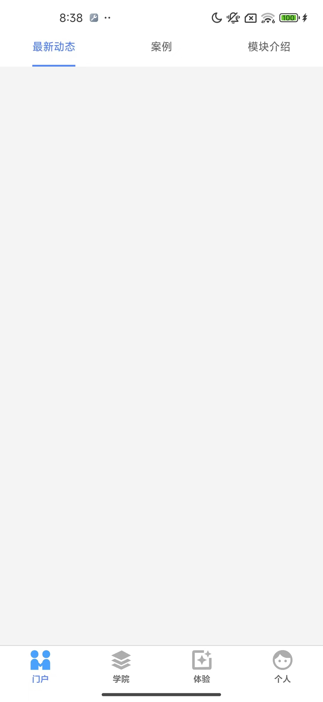
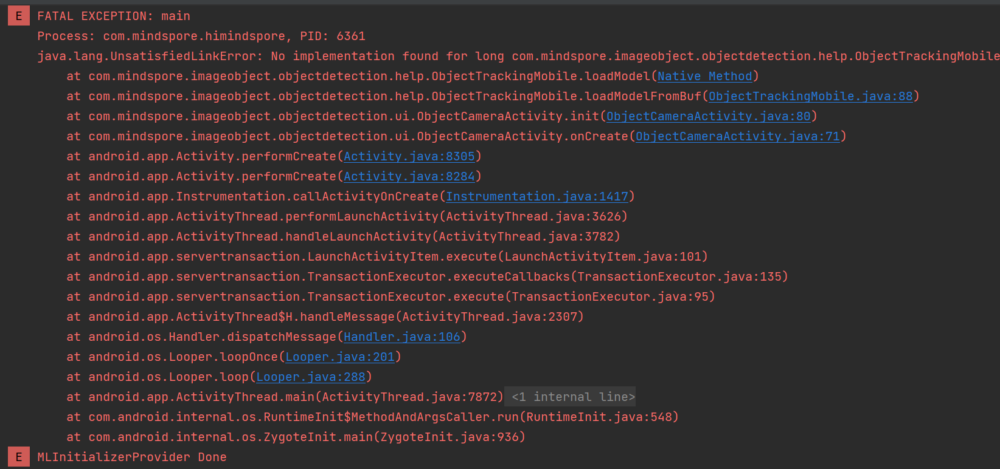
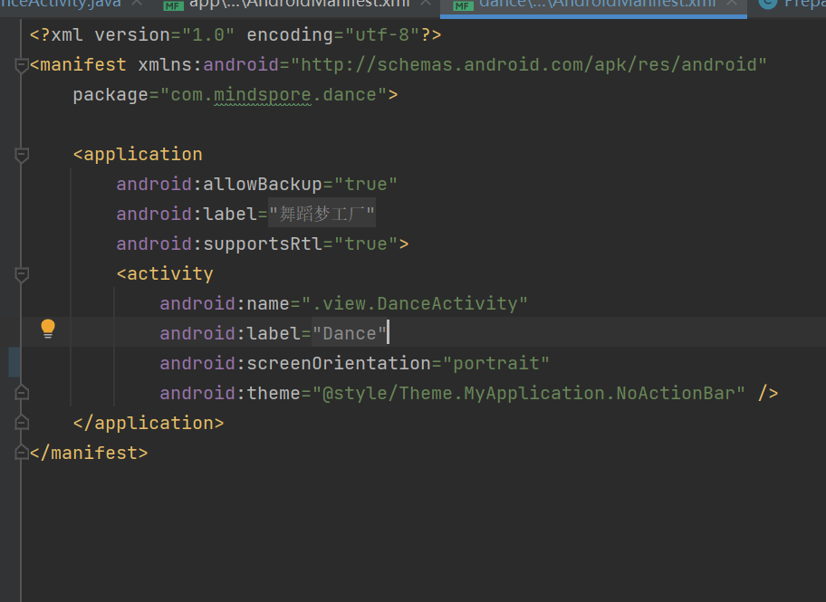
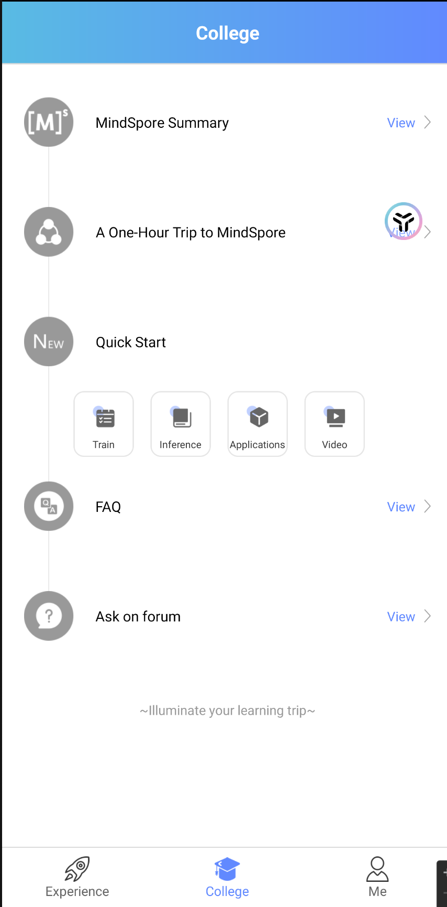

## 1.5.1版本问题

### 1. 进入软件后，最新动态，案例，模块介绍加载不出来，一直显示加载中。

   
   
   

### 2. 学院页面也是同样的问题，显示请检查网络后点击加载。

### 3. 体验页面

1. 风格迁移模块每次只能拍一张照片，拍完后无法再次拍照，只能返回主页重新进入。
2. 点击返回键，软件会直接退出。
3. 人脸识别功能拍照后没有反应。
4. 智能写诗网页打开后是空内容。

   

其余模块未发现明显问题。

## 1.2.8软件问题汇总
1. 问题1：软件只能在arm架构的手机上加载网络模型，在x86虚拟安卓机上无法加载。
   
2. 舞蹈梦工程无法使用，页面显示不齐全。
   
   该页面被设置为了横屏，但是页面是按竖屏设计的所以显示不全，只有半屏。更改后正常显示。
3. Quick Start内容网页都已经失效，打开后为空页面。
   

   
   
